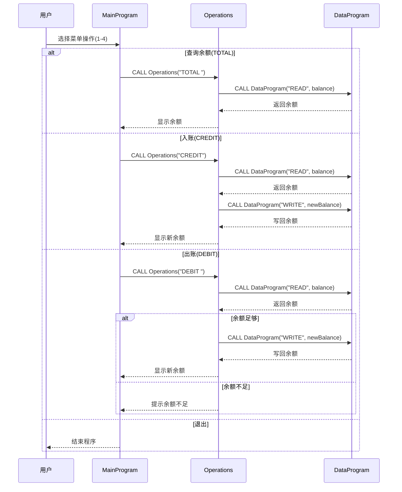

# COBOL 模块说明

本目录记录 COBOL 代码中每个文件的用途、关键功能，以及与学生账户相关的业务规则。

## src/cobol/main.cob（MainProgram）
**用途**：
- 作为账户管理系统的主入口，提供交互式菜单。

**关键功能**：
- 展示菜单选项：查询余额、入账（Credit）、出账（Debit）、退出。
- 根据用户选择调用 `Operations` 子程序并传递操作类型。

**学生账户业务规则**：
- 菜单只允许 1-4 的选项，其他输入提示无效。

## src/cobol/operations.cob（Operations）
**用途**：
- 执行账户业务操作（查询余额、入账、出账）。

**关键功能**：
- 接收操作类型并调用 `DataProgram` 读取/写入余额。
- 计算入账/出账后的余额并输出结果。

**学生账户业务规则**：
- 初始余额默认从数据层读取（默认 1000.00）。
- 出账金额不能超过当前余额，否则提示“余额不足”。
- 入账与出账操作完成后必须写回余额。

## src/cobol/data.cob（DataProgram）
**用途**：
- 作为数据访问层，负责在内存中保存账户余额。

**关键功能**：
- `READ` 操作：将存储余额返回给调用方。
- `WRITE` 操作：将调用方余额写回存储区。

**学生账户业务规则**：
- 余额在程序内存中维护，初始值为 1000.00。
- 只支持 `READ` 与 `WRITE` 两种操作类型。

## 应用程序数据流序列图

